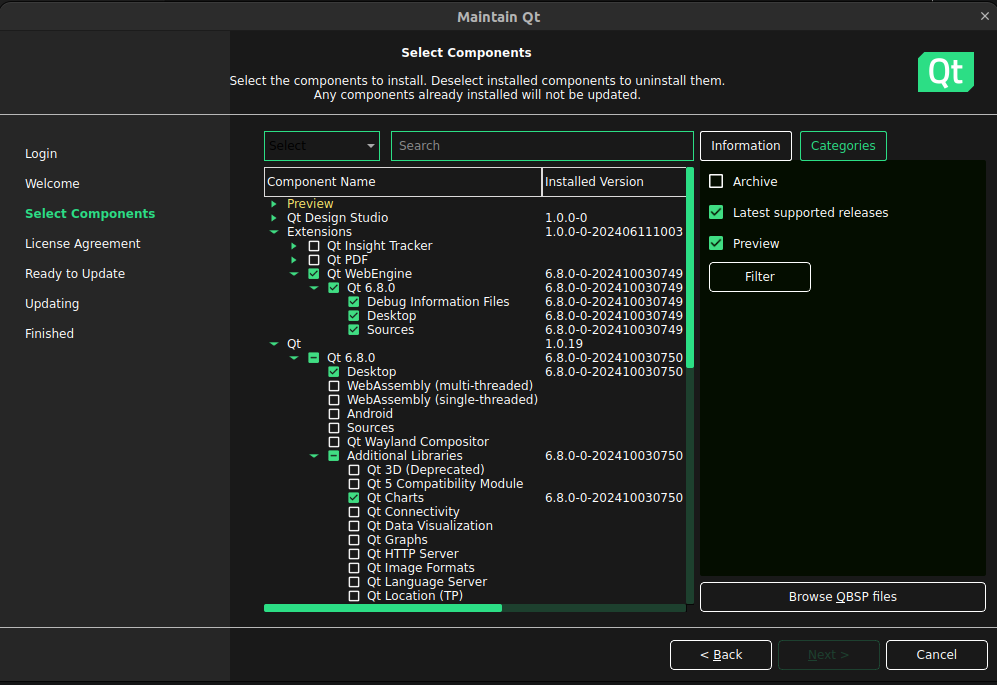
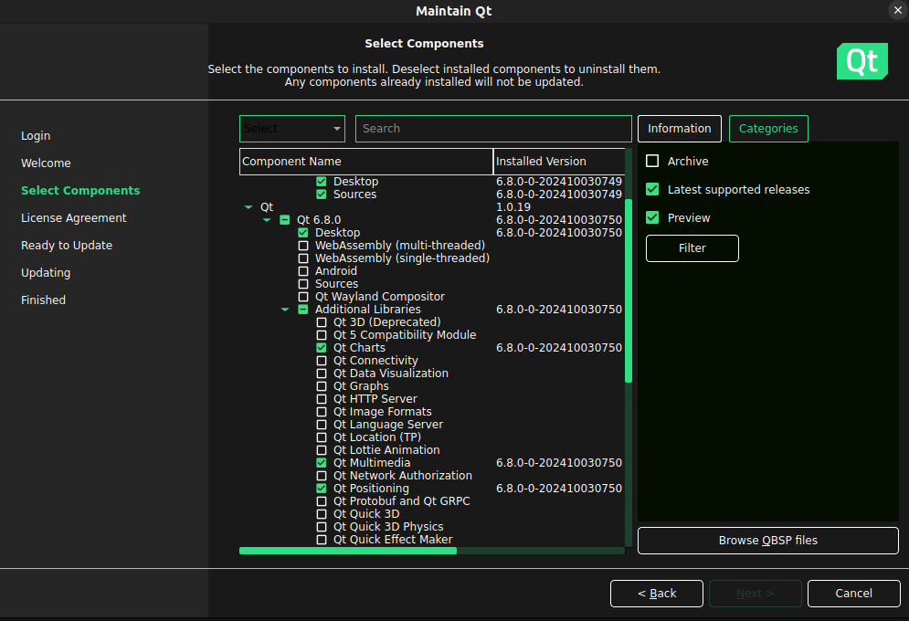
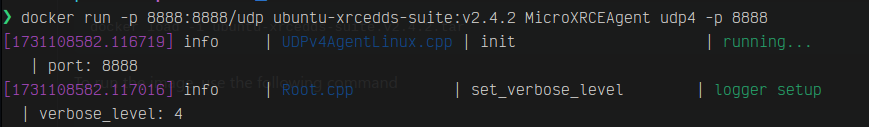

# PX4, ROS2 Humble, uXRCE-DDS, and Qt6 Setup

This repo is intended to get one familiar with with making custom ROS2 packages that will interface with PX4 Autopilot through uXRCE-DDS (Micro-XRCE-DDS).

A simple example package under ``src/drone_control`` is given of a ROS2 package that includes a small Qt app with an arm, disarm, takeoff, and land button with a map showing the current location of your vehicle.


## Prerequisites
- CMake
- Docker
- Ubuntu 22.04 LTS
    - Other versions of Ubuntu and/or Debian distributions will probably work, but haven't been tested
- ROS2 Humble
- PX4 Autopilot (included in repo as a submodule)
- PX4 Ros Com (included in repo as a submodule)
- PX4 Msgs (included in repo as a submodule)
- QGroundControl Daily Build
- Qt

## Step 1: Prerequisite Setup

### CMake
To install CMake on Ubuntu 22.04 LTS, you can simply run the following

```
sudo apt update
sudo apt install cmake
```

Verify that it installed correctly by running

```
cmake --version
```

### Docker
Installing Docker is slightly more involved. [Click here](https://docs.docker.com/engine/install/ubuntu/) for full instructions for installing Docker on Ubuntu 22.04 LTS. This is primarily going to be used to set up uXRCE-DDS Agent as building it from scratch, albeit easy, can be very annoying due to some common dependency version mismatches depending on your system (particularly between the libraries called ``libfmt`` and ``spdlog``).

### Ubuntu 22.04 LTS
Other versions of Ubuntu might work, but hasn't been tested. Likewise for other Debian-based Linux distributions.

If you're on **Windows**, you can actually still get this repo up and running using [WSL](https://en.wikipedia.org/wiki/Windows_Subsystem_for_Linux) (Windows Subsystem for Linux). [Click here](https://learn.microsoft.com/en-us/windows/wsl/install) to learn how to get this up and running on your Windows system. 

If you're on **macOS**, there are also some options for you to get this repo up and running. The most versatile way would be to use a [virtual machine](https://en.wikipedia.org/wiki/Virtual_machine), such as [VirtualBox](https://www.virtualbox.org/).

You can also use Multipass which is Canonical's official way to get Ubuntu in particular up and running on macOS systems which also supports Apple silicon (which at the time of writing are the M-series processors). Setting this up is quite simple and all you'll need is to make sure you have [Homebrew](https://brew.sh/) installed. You can refer to [this video](https://www.youtube.com/watch?v=oi8f6hVI2P4) for full installation instructions.

### ROS2 Humble & PX4
Simply run the following to get ROS2 Humble's dependencies and ROS2 itself

```
sudo apt update && sudo apt install locales
sudo locale-gen en_US en_US.UTF-8
sudo update-locale LC_ALL=en_US.UTF-8 LANG=en_US.UTF-8
export LANG=en_US.UTF-8
sudo apt install software-properties-common
sudo add-apt-repository universe
sudo apt update && sudo apt install curl -y
sudo curl -sSL https://raw.githubusercontent.com/ros/rosdistro/master/ros.key -o /usr/share/keyrings/ros-archive-keyring.gpg
echo "deb [arch=$(dpkg --print-architecture) signed-by=/usr/share/keyrings/ros-archive-keyring.gpg] http://packages.ros.org/ros2/ubuntu $(. /etc/os-release && echo $UBUNTU_CODENAME) main" | sudo tee /etc/apt/sources.list.d/ros2.list > /dev/null
sudo apt update && sudo apt upgrade -y
sudo apt install ros-humble-desktop
sudo apt install ros-dev-tools
source /opt/ros/humble/setup.bash && echo "source /opt/ros/humble/setup.bash" >> .bashrc
```
And
```
pip install --user -U empy==3.3.4 pyros-genmsg setuptools
```

This script was taken from [this user guide on PX4s documentation](https://docs.px4.io/main/en/ros2/user_guide.html), which was subsequently taken from [the ROS 2 documentation for installing ROS2 Humble on Ubuntu](https://docs.ros.org/en/humble/Installation/Ubuntu-Install-Debs.html). Refer to each for more detail and/or if you encounter any issues.

For PX4, run the script under ``src/PX4-Autopilot/Tools/setup/ubuntu.sh`` to install all dependencies for PX4 autopilot. You should restart your computer after this is finished.

### QGroundControl Daily Build
QGroundControl is a [Ground Control Station](https://en.wikipedia.org/wiki/UAV_ground_control_station) software that is typically used in conjunction with PX4 autopilot systems.

There are two different release types of QGroundControl, which are the stable and daily build versions. The daily build always has the "absolute latest set of features", but is needed to set up this repo. [Click here](https://docs.qgroundcontrol.com/Stable_V4.3/en/qgc-user-guide/releases/daily_builds.html) to download it for Linux (comes bundled as an [AppImage](https://en.wikipedia.org/wiki/AppImage)).


### Qt

Head on on over [here](https://doc.qt.io/qt-6/get-and-install-qt.html) for instructions on how to install Qt. Remember to keep track of your installation folder -- this will contain a bunch of necessary library files and C/C++ headers that you will need to know in order to properly build the rest of the project. 

Once you have Qt set up and installed, use the maintenance tool and install the following if you haven't already:

- Qt WebEngine
- Additional Libraries
    - Qt Charts
    - Qt Multimedia
    - Qt Positioning
    - Qt WebChannel





Should you encounter any other dependency issues with Qt (the Qt folder should have everything for Qt itself, but other dependencies might include the following):

```
# Qt Charts dependencies
sudo apt-get install libgl1-mesa-dev

# Qt Multimedia dependencies
sudo apt-get install libasound2-dev libpulse-dev \
    gstreamer1.0-plugins-base gstreamer1.0-plugins-good \
    gstreamer1.0-plugins-bad gstreamer1.0-plugins-ugly \
    gstreamer1.0-libav \
    libgstreamer1.0-dev libgstreamer-plugins-base1.0-dev \
    libopenal-dev

# Qt Positioning dependencies
sudo apt-get install libbluetooth-dev \
    libgypsy-dev \
    libgconf2-dev

# Qt WebChannel dependencies
sudo apt-get install libssl-dev
```

## Step 2: Build & Run

Once you've installed ROS2 Humble, you should have a folder ``/opt/ros/humble``.
You won't be able to run ``ros2`` commands by default, so you'll have to source this in your shell by running:

```
source /opt/ros/humble/setup.bash
```

If you want to avoid doing this all the time whenever you open a new terminal shell, you can simply add it to your ``.bashrc`` file, which is something that runs whenever you open a new terminal instance (hence the above command will run automatically)

Run the following

```
nano ~/.bashrc
```

You'll be greeted with what is basically a terminal text editor. Scroll to the bottom using your down arrow key or scroll wheel, and add the line ``source /opt/ros/humble/setup.bash`` (in the terminal use Ctrl+Shift+V to paste, Ctrl+X to request to exit, then press 'Y' to save).

Make sure to refresh your ``bashrc`` as well by running

```
source ~/.bashrc
```

### Step 2.1: Get the repo

Go to the directory you want to install the repo in, and run the following:

```
git clone https://github.com/Argyraspides/PX4_ROS2_uXRCE_DDS_Qt.git
```

Then go into the actual repo folder you just cloned
```
cd PX4_ROS2_uXRCE_DDS_Qt
```

And then install all the submodules (this will go ahead and clone PX4-Autopilot, px4_ros_com, and px4_msgs). This will take quite a while. px4_ros_com and px4_msgs are very small, but PX4-Autopilot is pretty huge

```
git submodule update --init --recursive
```

### Step 2.2: Build the workspace

You can now go ahead and actually build the workspace. Again, this will take a while (~3 minutes on a Ryzen 5 5600X) by running

```
colcon build
```

If you encounter the following issue: ``canonicalize_version() got an unexpected keyword argument 'strip_trailing_zero'``, ensure you have the following pip package version and try again:

```
pip install setuptools==58.2.0 --user
```

Another issue you may encounter is ``drone_control`` (the example provided under ``src/drone_control``) not building properly because it failed to find some Qt dependencies. In the CMakeLists.txt file, there is a line:

``set(CMAKE_PREFIX_PATH "${CMAKE_PREFIX_PATH};~/Qt/6.8.0/gcc_64")`` 

Which lets CMake know to also look in the Qt installation directory for any other dependencies. Depending on which version of Qt you installed, and where exactly you decided to install Qt, this path and version might be different. Look for it, and replace ``~/Qt/6.8.0/gcc_64`` with the correct path. You can then attempt to build again.

``colcon build`` builds all the ROS2 packages it finds your workspace (and it figures this out by looking for a package.xml file, which you can see in ``src/drone_control``).

Then, in a separate terminal, make sure that you can properly build PX4-Autopilot and Gazebo. Navigate to ``src/PX4-Autopilot`` and run the following (which, unfortunately, will take a while when doing it for the first time)

```
make px4_sitl_default gz_x500
```

Make sure you run this command in a terminal outside of VSCode's integrated terminal, as it is fussy about launching GUI applications sometimes.

``px4_sitl_default`` is basically the autopilot firmware (px4) which will be built specifically for software simulations (sitl -- "software in the loop"). The ``gz_x500`` refers to the simulator (gz -- [Gazebo](https://gazebosim.org/home)), with the [x500 airframe](https://holybro.com/products/x500-v2-kits) (this is just a quadcopter airframe).

If you encounter any issues about Gazebo failing to create a bridge, this may be due to your firewall. The simplest solution is to just temporarily turn it off while you're using the simulator. You can [install this simple GUI tool](https://help.ubuntu.com/community/Gufw) to toggle your firewall on/off:

```
sudo apt-get install gufw
```
Another issue you might encounter is ``ERROR [gz_bridge] Service call timed out. Check GZ_SIM_RESOURCE_PATH is set correctly.``, and the Gazebo simulator won't start up properly. You can set the path by running the following

```
nano ~/.bashrc
```

Then adding the following lines to the bottom of the file (replace file paths with wherever your actual project is):

```
export GZ_SIM_RESOURCE_PATH="$GZ_SIM_RESOURCE_PATH:/PATH TO YOUR PROJECTS ROOT DIRECTORY/src/PX4-Autopilot/Tools/simulation/gz/models"

export GZ_SIM_RESOURCE_PATH="$GZ_SIM_RESOURCE_PATH:/PATH TO YOUR PROJECTS ROOT DIRECTORY/src/PX4-Autopilot/Tools/simulation/gz/worlds"
```

Gazebo basically just wants to know where the world files are to simulate the environment and where the model files are to grab the actual airframes. Make sure to refresh your ``bashrc`` as well by running

```
source ~/.bashrc
```

You should now see the Gazebo simulator running with a quadcopter sitting on the ground.

### Step 3: Running uXRCE-DDS and your ROS2 package

uXRCE-DDS is basically just the middleware that allows you to communicate with your PX4 firmware. ROS2 will typically be doing more complicated stuff like advanced route planning and sits on a [companion computer](https://dojofordrones.com/companion-computers/), while PX4 will be handling low-level flight controls and autopilot modes.

Go to the releases tab and follow the instructions to set up the Docker image (make sure you do this in a separate terminal once again). Then go ahead and run the Docker image. Your Micro-XRCE-DDS agent will be running, and look something like the following:




You're now done with uXRCE-DDS. Leave it running for now.

When you last built your workspace using ``colcon build``, you built the ROS2 package example provided in ``src/drone_control``. This created three folders in the root directory, ``build``, ``install``, and ``log``. The ``install`` directory is what contains the actual executable binary that is your ROS2 package. In the example provided, it is a simple Qt GUI application. To actually run it, you can run the ``build.sh`` and ``run.sh`` scripts under ``src/drone_control``. In the ``build.sh`` script, there is the following line:

``LD_LIBRARY_PATH=$LD_LIBRARY_PATH:~/Qt/6.8.0/gcc_64/lib ros2 run drone_control drone_controller``

Seem familiar? Replace the Qt path from previously to your actual Qt path. You can then run:

```
./build.sh && ./run.sh
```

If you encounter any permission errors, you can give the scripts executable permissions by running

```
sudo chmod +x <name of the script>.sh
```

### Step 4: Running QGroundControl Daily Build

This is easy, don't worry. Just go to wherever you downloaded QGroundControl Daily Build, open a terminal in that folder, then run:

```
./<Name Of The QGroundControlFile>.appimage
```
 
If you still have PX4 Autopilot running (``make px4_sitl_default gz_x500``), QGroundControl should connect to PX4 automatically. You can test to make sure everything works by taking off (button is in the top left corner). You should see your quadcopter start flying and hovering in position.

### Step 5: Running the Qt app

Finally, you can use the Qt app to control the drone as well. Click any of the buttons and stuff should happen! Remember you must arm the drone first before taking off.

## How it works (very high level overview)

### Data Flow

#### Command Flow

- User interacts with Qt application
- Qt sends commands to ROS2 nodes
- ROS2 messages are bridged through uXRCE-DDS
- PX4 receives and executes commands
- Gazebo simulates the physical response


#### Telemetry Flow

- PX4 generates vehicle state data (GPS & Odometry data in the example provided)
- Data is sent through uXRCE-DDS to ROS2
- ROS2 receives the data and calls the callback functions 
- Qt application updates its display